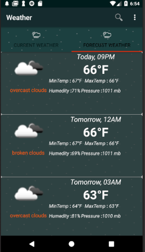
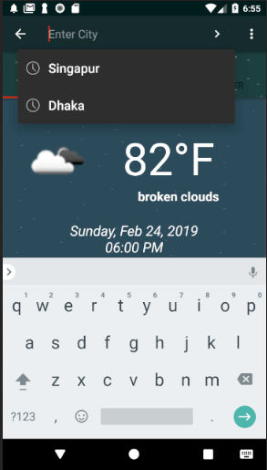

#  Show  Weather
    See the current weather and forcast weather  using  user device latitude longitude  and also                              
    search by city .  That is a team project  , me  and my other 2  members  build this software
     
    Using  
    Java, AndroidStudio
    Weather API

